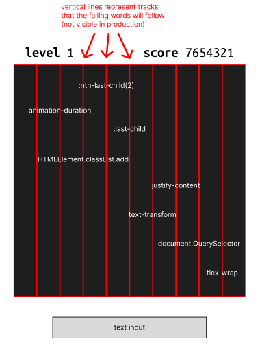

## Your choice of game.

Typing Game (not in the Project 1 list)

A typing game where the player has to successfully type words falling from the top of the screen before they fall below the line at the bottom of the screen.

The player is given a set amount of words to type. Word categories and difficulty settings can be changed.

## User Stories

1. as a Player, i want words to spawn on the screen
1. as a Player, i want to be able to type words into an input field as a way destroy words on the screen
1. as a Player, i want the words to spawn one-at-a-time at a set interval
1. as a Player, i want the words to spawn from the top of the screen and to fall to the bottom of the screen
1. as a Player, i want the game to end if a word falls to the bottom of the screen
1. as a Player, i want the words to randomly spawn at a random spot from the top of the screen
1. as a Player, i want to be able to start the game when i am ready
1. as a Player, i want to be able to read the rules on how to play the game
1. as a Player, i do not want the same word appearing multiple times on the screen

## A wireframe of your "main" game screen.

## Pseudocode for the overall game play.

1. build word categories (as select option elements) using word bank object in constants
2. build difficulties  (as select option elements) using difficulty object in constants
3. take player to main menu
   - options submenu to read rules and change difficulty, word categories
   - randomize button to quickly change difficulty and categories
4. player starts game - load game is triggered
5. load game looks at set categories and difficulties in order to:
   - copy a randomized sort of the chosen word bank category
   - set interval number
   - start game loop via setInterval
6. game runs: 
   - interval determines both word spawn rate drop speed (with some calulation and variability)
   - setTimeouts are generated for each wordspawn with delay equal to complete animation time
      - setTimeouts will trigger a game over once set delay is realized (lose condition)
   - successfully typing a word on screen will:
       - remove the element
       - clear respective timeout
       - decrease word count
   - if word count = 0, game ends and player wins (win condition)
